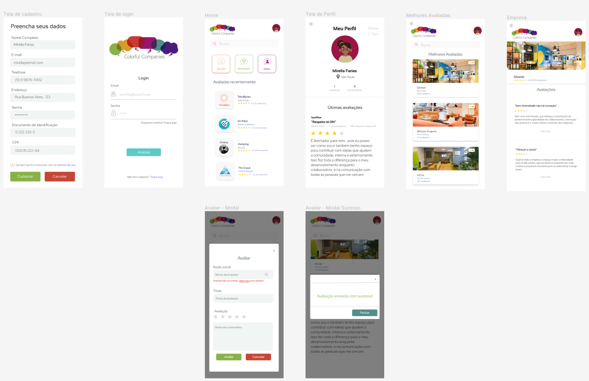
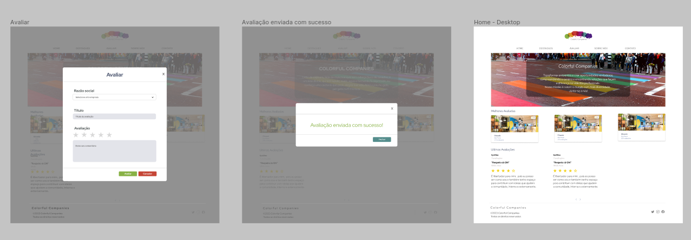
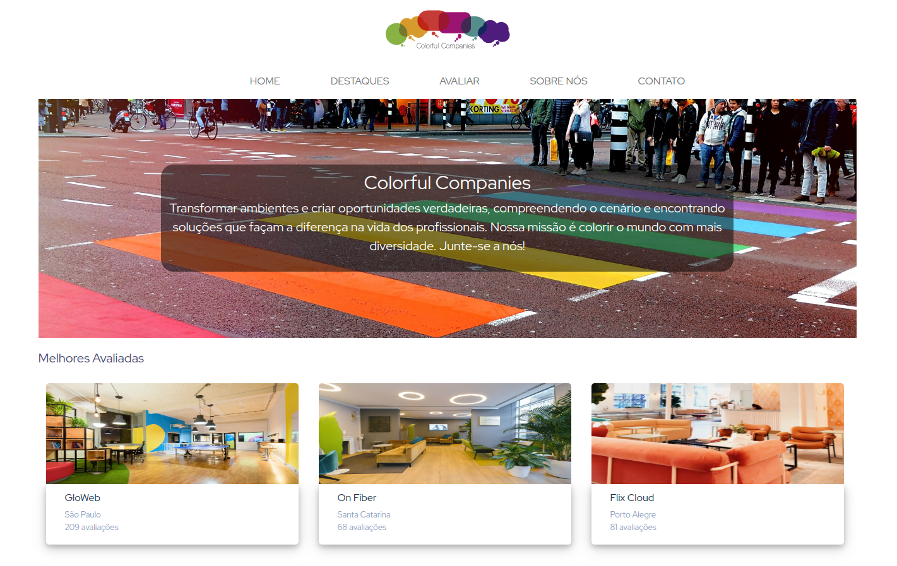
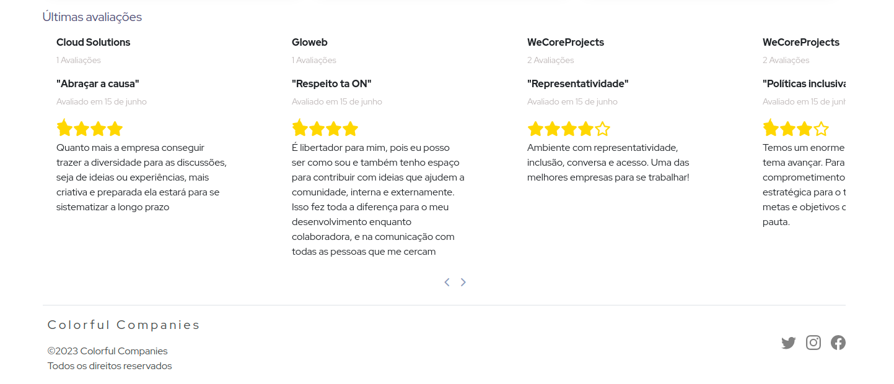

<h1 align="center">Colorful Companies</h1>
<h3 align="justify">University project</h3>

This project aims to create a platform for evaluating and promoting organizations with a focus on diversity and inclusion.

<h2>Installation</h2>

To install the project dependencies, execute the following command:

<pre><code>npm install</code></pre>
<h2>Execution</h2>

Before running the project, you need to create the database. Make sure to have the correct database configuration in the configuration file.

Additionally, you need to add sample data for "person", "organization", and "ratings" to visualize the evaluations in the "Latest Reviews" section of the interface. Follow the provided image in the "Interface" section for reference.

To run the project, use the following command:

<pre><code>npm run dev</code></pre>
<h2>About the Project</h2>

Colorful Companies is an application that allows users to evaluate and share experiences about companies in terms of their receptiveness and inclusion of the LGBTQIAP+ community. Hiring and motivating these professionals are fundamental to creating a safe, diverse, and inclusive work environment.

By evaluating various registered organizations on the platform and sharing experiences, the project aims to provide a more transparent view of these companies, reflecting the reality experienced by LGBTQIAP+ professionals.

Ranking companies based on affirmative policies of equality and inclusion intends to encourage organizations to invest in the intellectual and professional potential of this community, offering opportunities and representation.

Join us in the movement for equality and inclusion in companies!

<h2>Prototype</h2>

Mobile

  
  
Web

   

<h2>Interface</h2>
  
   

 <a href="https://www.linkedin.com/in/mariana--trombini/">LinkedIn</a>.
